[TOC]


### 0 环境

​	JDK:8

​	Maven:3

### 1 spring boot启动模板项目

#### 1.1 在spring官网创建项目模板

- 访问网址：https://start.spring.io/，选择Spring Web dependence


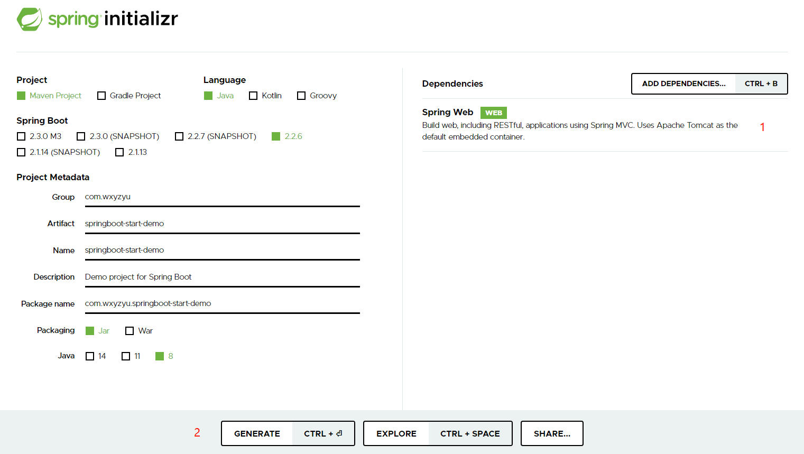 

- 点击generate后自动下载项目zip

 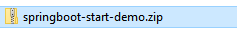

- 在IDEA导入


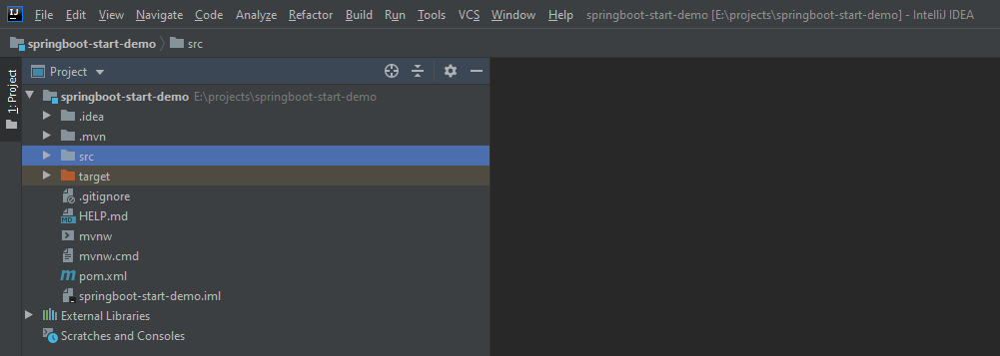

#### 1.2 验证项目

- 添加/hello映射，注意一定要加@RestController，要不然mapping不起作用

```java
@SpringBootApplication
@RestController
public class SpringbootStartDemoApplication {

	public static void main(String[] args) {
		SpringApplication.run(SpringbootStartDemoApplication.class, args);
	}
	//hello world :)
	@GetMapping("/hello")
	public String hello(@RequestParam(value = "name", defaultValue = "World") String name) {
		return String.format("Hello %s!", name);
	}
}
```

- 启动服务

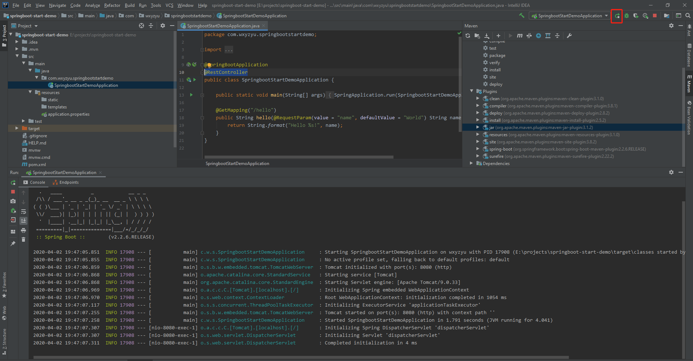  

- 测试，访问http://localhost:8080/hello

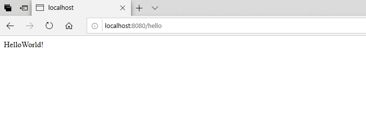 

### 2 将新建项目上传到github

- 添加github账号到idea

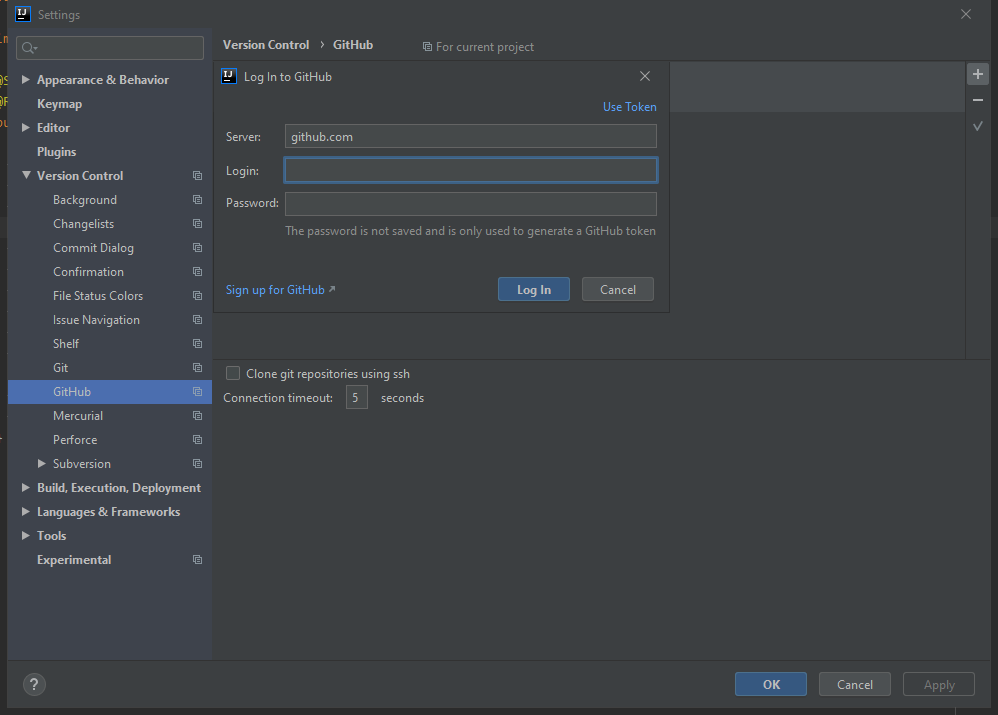

- 创建本地repository


- 选中要提交的项目目录，点击"OK"

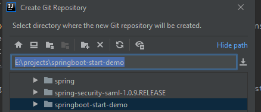 

- 目录中文件变为红色

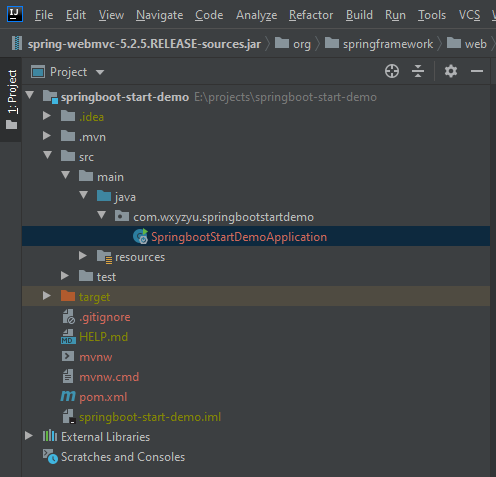 

- 文件目录下多了.git隐藏文件夹

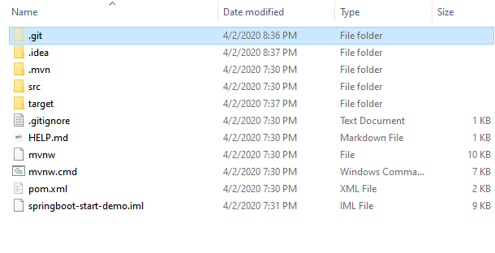 

- 添加到git，相当于svn的add

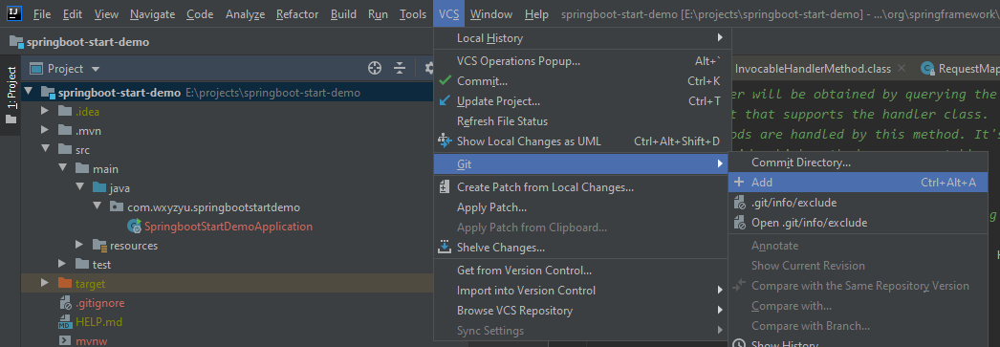 

- commit文件，相当于svn的commit，只是commit到本地仓库

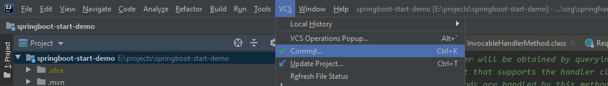

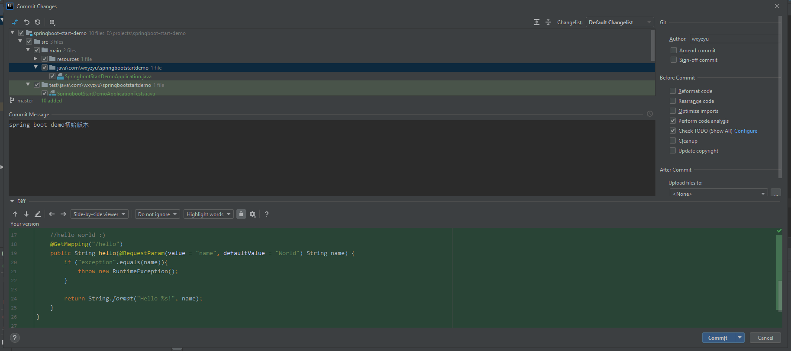

- push到github，执行完这一步之后才会发送到github

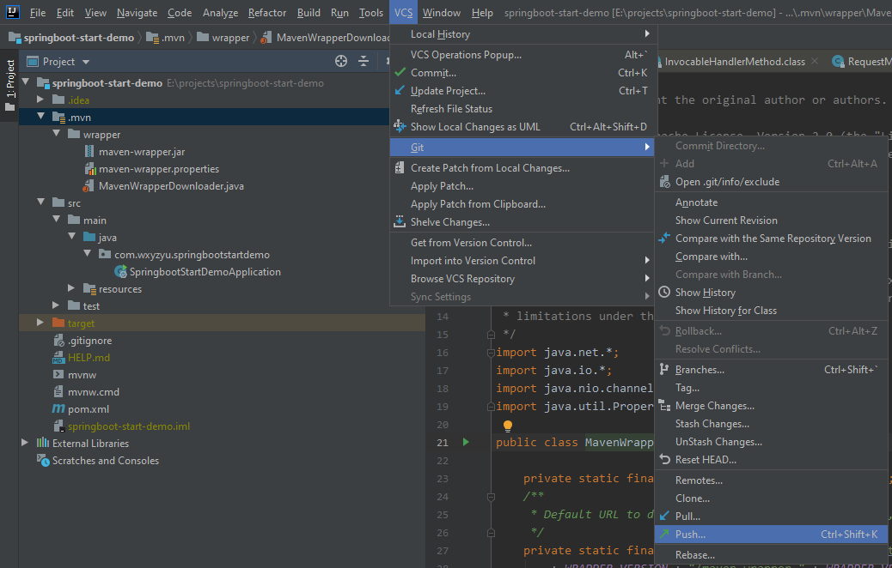

